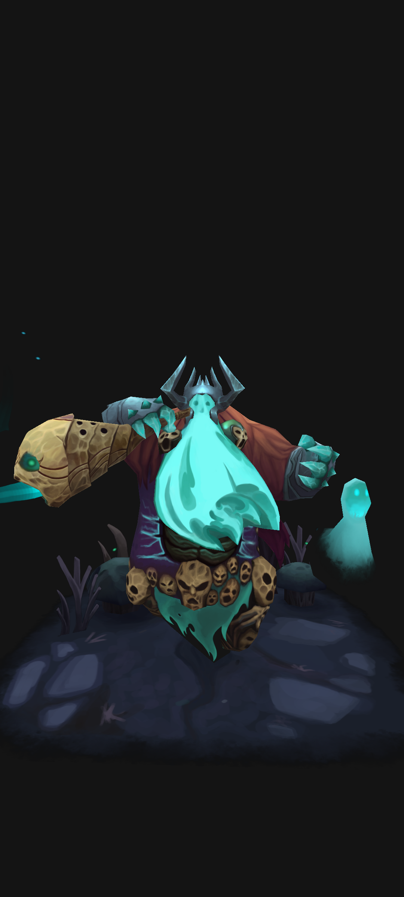
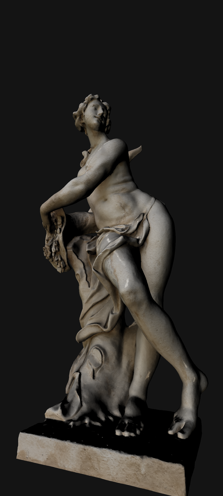

# 3D Model Viewer for Android

## Table of Contents

- [Introduction](#introduction)
- [Features](#features)
- [Screenshots](#screenshots)
- [Installation](#installation)
- [Usage](#usage)
- [Contributing](#contributing)
- [License](#license)
- [Acknowledgements](#acknowledgements)

## Introduction

Welcome to the 3D Model Viewer for Android! This project aims to provide a lightweight, open-source 3D model viewer application for Android devices. It supports various 3D model formats and offers a user-friendly interface for viewing and interacting with 3D models.

## Features

- **Support for Multiple Formats:** View models in formats like OBJ, STL, FBX, and more.
- **Intuitive UI:** Easy-to-use interface with touch controls for zooming, rotating, and panning.
- **Performance Optimizations:** Efficient rendering for smooth performance on a wide range of devices.
- **Customizable:** Easily customizable and extendable for your needs.
- **Open Source:** Completely open-source under the MIT License.

## Screenshots

 

## Installation

### Prerequisites

- Android Studio
- Android SDK

### Steps

1. **Clone the Repository:**
   ```sh
   git clone https://github.com/darkmat13r/android-3dmodel-viewer.git
   cd android-3dmodel-viewer
   ```

2. **Open in Android Studio:**
   Open Android Studio, select `Open an existing project`, and navigate to the project directory.

3. **Build the Project:**
   Let Android Studio download the necessary dependencies and build the project.

4. **Run on a Device or Emulator:**
   Connect your Android device or start an emulator, then run the project from Android Studio.

## Usage (Under Development)

1. **Load a Model:** (Currently loaded from assets folder)
   Put 3d model in assets folder. Update the path in ModelImporter.

2. **View Controls:**
    - ~~**rotate:** Use one finger to rotate the model.~~
    - **Zoom:** Pinch with two fingers to zoom in and out.
    - ~~**Pan:** Use two fingers to move the model around the screen.~~


## Contributing

Contributions are welcome! Please read our [Contributing Guide](CONTRIBUTING.md) for details on our code of conduct and the process for submitting pull requests.

1. **Fork the Repository**
2. **Create a New Branch:**
   ```sh
   git checkout -b feature/your-feature-name
   ```
3. **Make Changes and Commit:**
   ```sh
   git commit -m 'Add some feature'
   ```
4. **Push to the Branch:**
   ```sh
   git push origin feature/your-feature-name
   ```
5. **Create a Pull Request**

## License

This project is licensed under the MIT License - see the [LICENSE](LICENSE) file for details.

## Acknowledgements

- [Assimp](http://www.assimp.org/) for the asset import library.
- [Android NDK](https://developer.android.com/ndk) for native development support.
- [OpenGL ES](https://www.khronos.org/opengles/) for rendering.
- Special thanks to all the contributors!

---

Feel free to reach out if you have any questions or need further assistance. Happy coding!
